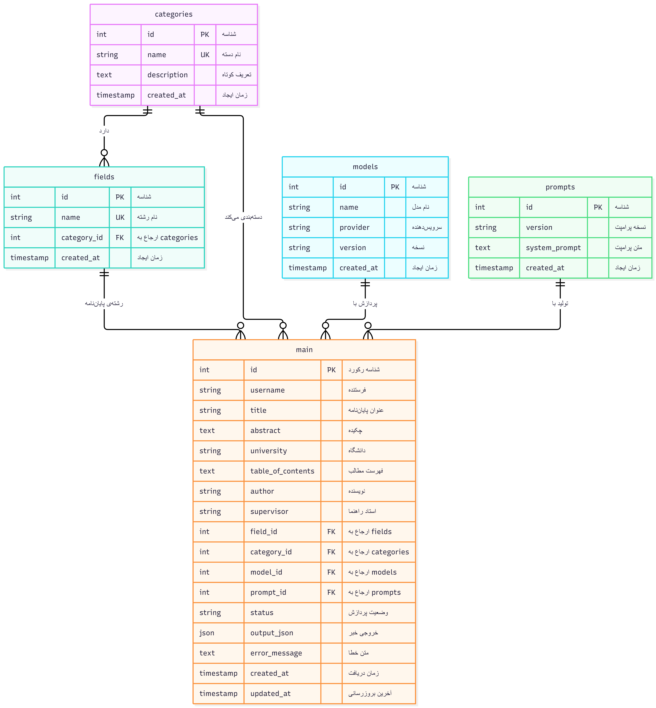

# News Generation Pipeline

A structured news-generation pipeline built with Python, Pydantic, PydanticAI, and AvalAI.

## Overview

This project validates structured news input data using Pydantic and sends the
validated abstract to a PydanticAI agent.

The agent uses an OpenAI-compatible AvalAI endpoint to generate a structured
news article containing:

- Title
- Lead
- Body

The generated result is validated using the GeneratedNews Pydantic model
and can then be serialized to JSON.

## Architecture

`text
Input JSON
    |
    v
NewsInput (Pydantic)
    |
    | Validation
    v
Abstract
    |
    v
PydanticAI Agent
    |
    v
AvalAI API
    |
    v
GeneratedNews (Pydantic)
    |
    v
Output JSON

## Database Schema 

[MermaidCode](docs/erd.md)